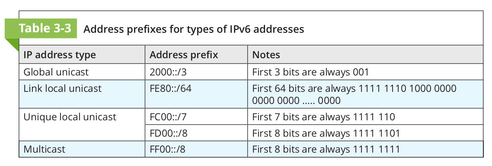

A 128-bit address assigned to a node in a network.

The format of this address contains 8x2-byte block,
where each 2-byte block is separated by a colon ie. 
`fe80:ccd3:fdec:1234:aeae:59af:51ef:8721`

## Classification of IPv6 Addresses
1. **Unicast address** specificies a single node on a network.
   there are two types of unicast address, namely:

   - **Global address** can be routed on the internet and is 
     similar to a public address in IPv4. Prefixed by `2000::/3`.

   - **Link local address** is used only for communicating with
     nodes on the same network. Prefixed by `fe80::/64`.

2. **Multicast address** delivers packets to all nodes in a targetted
   multicast group.

3. **Anycast address** identifies multiple destinations, with packets 
   delivered to the closest destination.

