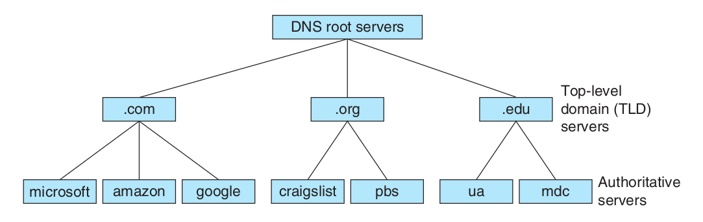
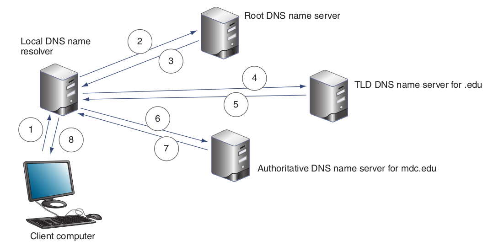

## Fully Qualified Domain Name (FQDN)
An address assigned to a host system that is used for human readability.
It contains three parts:

1. **Top-level Domain (TLD)** found at the last part of the address. This 
   part of the address is provided by organizations delegated by ICANN, 
   a non-profit organization that handles the coordination and maintenance 
   of DNS namespaces.

2. **Authoritative Name** found after the TLD. This part of the address is provided 
   by organizations that hold their specific DNS zones. 

3. **Host** found after the authoritative name and is assigned to a particular host 
   in a network that provides some service.

## Domain Name System (DNS)
Is a hierarchical system in the network that resolves names ie. domain names into IP 
addresses. The hierarchy goes as follows:

1. **DNS Root Servers** are servers that have records about **TLD Servers**.
2. **TLD Servers** are servers that have records about **Authoritative Servers**.
3. **Authoritative Servers** are servers that have records for different host names organized 
   by their *DNS Zones*.

## DNS Recursive Query
When a host system needs to resolve a particular domain name to get the IP address
of another host system in a network ie. on the internet what occurs is as follows:

1. The requesting host system queries its local DNS server for the IP address for 
   that domain name, if the local DNS server does not know then:

2. The local DNS server queries the DNS Root Servers to get the address of the TLD
   Name Server its domain name is assigned to, then:

3. The local DNS server queries the TLD Name Server to get the address of the 
   Authoritative Server its domain name is assigned to, then:

4. The local DNS server queries the Authoritative Server for the IP address of the 
   given domain name.
   

## Resource Records
Are types of records that are found within DNS Servers. Some resource records are 
provided as follows:

- **A** a resource record that resolves a DNS name to an IPv4 Address.
- **AAAA** resolves a DNS name to an IPv6 Address.
- **CNAME** resolves a domain name to another domain name.
- **Pointer (PTR)** resolves an IP Address to a domain name.
- **Nameserver (NS)** indicates the IP address of the authoritative name server 
  for some domain.
- **MX** identifies an email server.