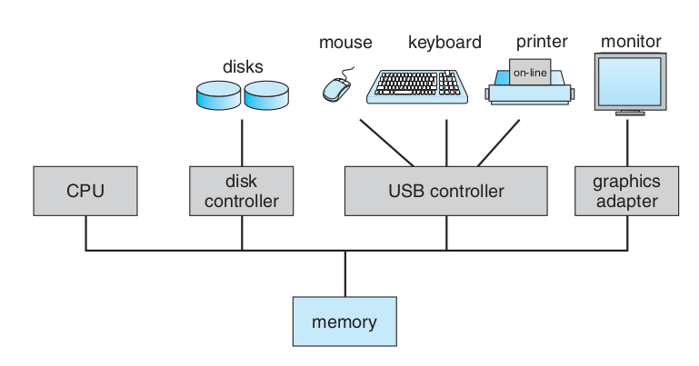
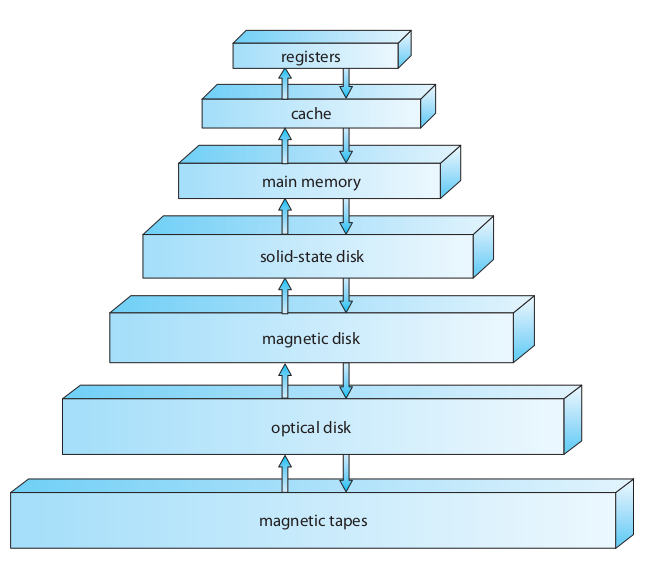

## Computer Organization
In most modern computer systems, a common computer organization is
comprised of one or more CPUs, device controllers and adapters, 
memory, and a common bus system that allows for each of these 
components to send and receive data from one another.

## Bootstrapping
Once a computer system is powered on, the first task that it has to 
do is load the **firmware**: software that is embedded into the 
computer system that bootstraps or initializes it.

The firmware is responsible for testing if individual components in 
the system are okay and locating and loading the operating system 
into memory.

## Interrupts
Events that occur in the computer system that halts the current 
execution of the CPU and is either generated by the hardware or 
via software through *system calls*.

## Storage Structure
Computer systems mostly adhere to a hierarchy of memory or storage 
systems that allow it to store data to or load data from.

This memory hierarchy goes from most expensive and fastest at the top 
then gets progressively cheaper and slower as it goes down the hierarchy.

In this case, the registers are the most expensive but fastest memory 
component, while the magnetic tapes are the most cheapest and slowest 
component in the hierarchy.

Memory can also be described as either *volatile* or *non-volatile*, 
where volatility means it needs power in order to persist data.

In the case of the hierarchy presented, the first three are all 
*volatile*, while everything below that is *non-volatile*.